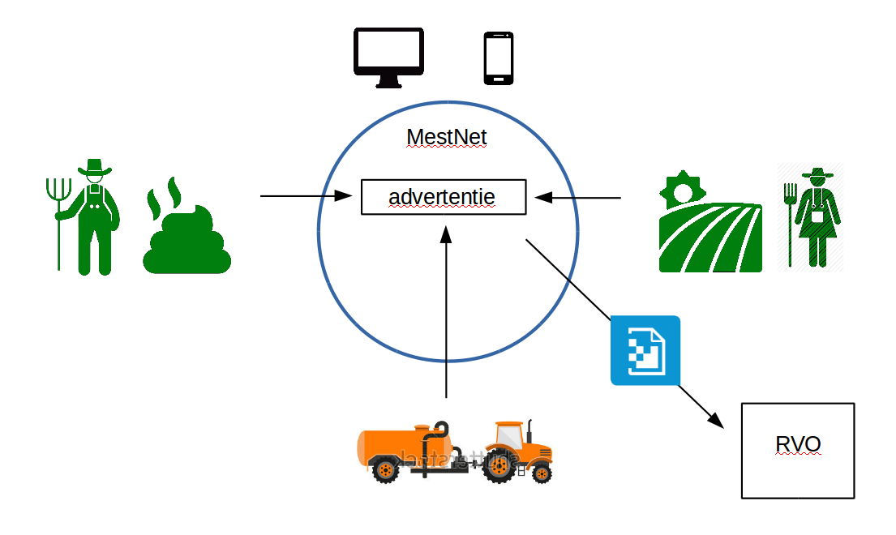

# MestHack 2017: 'MestNet'

Tijdens de 'mesthack' in oktober 2017 hebben we met een groepje een prototype gemaakt voor een gebruikersvriendelijke on-line mest-marktplaats, werktitel 'MestNet'.

Het idee hiervoor kwam van Aart Monster (http://www.monster-management.nl/consultant).

Het prototype is gemaakt met de tool 'JustInMind'. Deze tool kun je downloaden van www.justinmind.com.
Vervolgens kun je het bestand 'Mestnet.vp' openen met deze tool, en dan kun je het prototype (de website) 'runnen' (knop 'Simulate' in de tool).

# Overzicht van de oplossing

